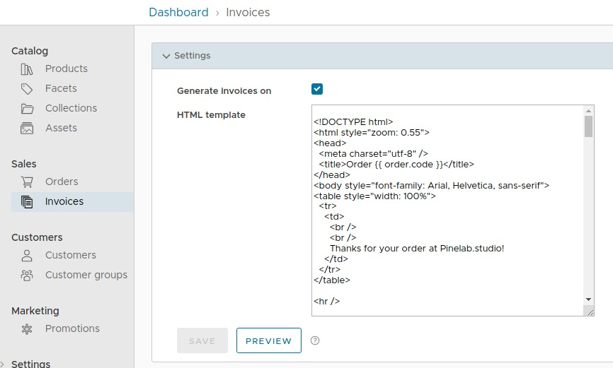
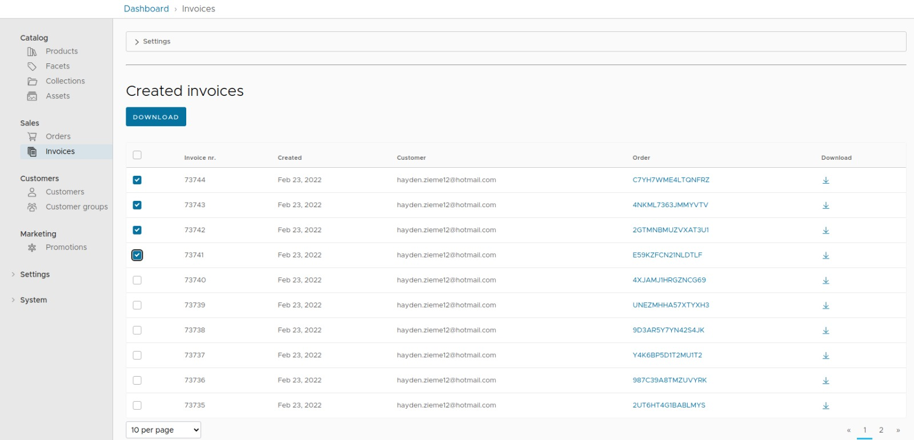

# Vendure Plugin for generating invoices


A plugin for generating PDF invoices for placed orders.

- Generates PDF invoices on OrderPlaced events
- Shows all generated invoices in Admin UI if you have the permission `AllowInvoicesPermission`
- Save an HTML template per channel via the Admin UI
- Download multiple invoices as zip via the Admin UI

For the developers:

- Customize invoice storage by implementing your own `StorageStrategy`
- Customize invoice numbering and template data by implementing your own `DataStrategy`

The default storage strategy is `LocalFileStrategy`, which stores invoices in the directory `invoices` in the root of
your project.

The default data strategy is `DefaultDatastrategy` which generates incremental invoicenumbers and passes
most order fields as template data.

## Getting started

1. Add the following config to your `vendure-config.ts`:

```js
plugins: [
  InvoicePlugin.init({
    // Used as host for creating downloadUrls
    downloadHost: 'http://localhost:3106',
  }),
  AdminUiPlugin.init({
    port: 3002,
    route: 'admin',
    app: compileUiExtensions({
      outputPath: path.join(__dirname, '__admin-ui'),
      extensions: [InvoicePlugin.ui],
      devMode: true,
    }),
  }),
];
```

2. Start Vendure and navigate to the admin
3. Make sure you have the permission `AllowInvoicesPermission`
4. Go to Sales > Invoices.
5. Unfold the `settings` accordion.
6. Check the checkbox to enable invoice generation for the current channel on order placement.
7. A default HTML template is set for you. Click the `Preview` button to view a sample PDF invoice.

The bottom table holds an overview of already generated invoices.

## Adding invoices to your order-confirmation

Invoices are generated via the worker and are not available when order confirmations are send. What you can do is add the following link to your email:
`https://<your server>/invoices/e2e-default-channel/C7YH7WME4LTQNFRZ?email=hayden.zieme12@hotmail.com`.

The server will check if the ordercode belongs to the given channel AND the given customer emailaddress. If so, it will return the invoice.

## Google storage strategy

This plugin also includes a strategy for storing invoices in Google Storage.
Make sure you install the Gcloud package:
`yarn add @google-cloud/storage`

and set the folling config:

```js
InvoicePlugin.init({
  downloadHost: 'http://localhost:3050',
  storageStrategy: new GoogleStorageInvoiceStrategy({
    bucketName: 'bucketname',
  }),
});
```

The strategy will use the projectId and credentials in from your environment, so if you are running in Cloud Functions or Cloud Run you should be fine with this config.

:warning: However, if you want to run it locally or on some other environment, use this:

```js
InvoicePlugin.init({
  downloadHost: 'http://localhost:3050',
  storageStrategy: new GoogleStorageInvoiceStrategy({
    bucketName: 'bucketname',
    storageOptions: {
      keyFilename: 'key.json',
    },
  }),
});
```

This is needed to generate signedUrls, which are used to give customers temporary access to a file on Storage.
See this info for info about locally using signedUrls: https://github.com/googleapis/nodejs-storage/issues/360

## Custom file storage

Implement `RemoteStorageStrategy` or `LocalFileStrategy` interface to create your own way of storing invoices.

```js
/**
 * The invoice plugin will first try to use getPublicUrl, when that function is
 * not implemented, it will try to stream the file to the client
 */
export type StorageStrategy = RemoteStorageStrategy | LocalStorageStrategy;

interface BaseStorageStrategy {
  /**
   * Store the given file where you want and return a reference
   * that can later be used to retrieve the same file
   * You receive the path to the created
   * tmpFile
   */
  save(
    tmpFile: string,
    invoiceNumber: number,
    channelToken: string
  ): Promise<string>;

  /**
   * Bundles multiple files by invoiceNumbers in zipFile for download via admin UI
   * Will only be called by admins
   */
  streamMultiple(invoices: InvoiceEntity[], res: Response): Promise<ReadStream>;
}

export interface RemoteStorageStrategy extends BaseStorageStrategy {
  /**
   * Returns a downloadlink where  user can download the Invoice file.
   * For example an downloadLink to a Google storage bucket
   * or Amazon S3 instance
   */
  getPublicUrl(invoice: InvoiceEntity): Promise<string>;
}

export interface LocalStorageStrategy extends BaseStorageStrategy {
  /**
   * Stream the file via the server to the client.
   * Use res.set() to set content-type
   * and content-disposition
   */
  streamFile(invoice: InvoiceEntity, res: Response): Promise<ReadStream>;
}
```

## Custom invoice numbering and custom data

Implement the `DataStrategy` to pass custom data or generate custom invoicenumbers:

```js
export class DefaultDataStrategy implements DataStrategy {
  async getData({
    injector,
    order,
    latestInvoiceNumber,
    ctx,
  }: DataFnInput): Promise<InvoiceData> {
    return {
      invoiceNumber: String(Math.floor(Math.random() * 90000) + 10000),
      customerEmail: 'just used for admin display',
      order,
      someCustomField: '2022',
    };
  }
}
```

You can access this data in your HTML template using Handlebars.js:

```html
<h1>{{ someCustomField }}</h1>
```

## Admin UI screenshots

(Images don't show on NPM, visit Github instead)



## Contributing

Contributions always welcome! Just create a PR on Github. The commands you need:

```shell
# Run e2e test
yarn test

# Start server with auto-reloading admin UI
yarn start

# Serve auto-reloading backend. This sometimes messes with phantom processes
# from admin ui compilation. You might want to disable admin compilation
# in dev-server.ts if you use this
yarn serve
```

Reach out to me at [pinelab.studio](https://pinelab.studio) if you need any help.
[](https://pinelab.studio)
